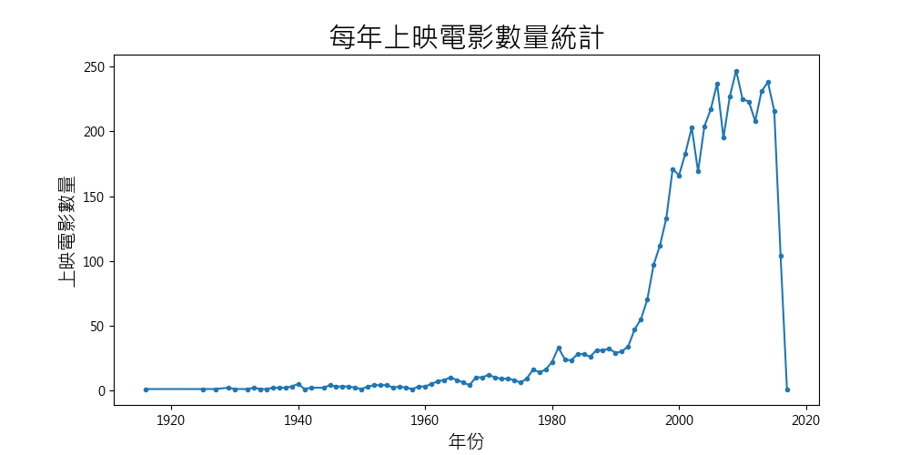

# TMDB Movie Data Analysis

本專案使用 Python 對 **Kaggle平台上的TMDB (The Movie Database)** 的電影資料進行分析，並透過多種可視化圖表展示結果。


## 使用方法
1. 安裝必要套件：
   ```bash
   pip install -r requirements.txt
   ```

2. 執行分析：
   ```bash
   python tmdb_analysis.py
   ```

## 分析標的
1. 票房最高前10電影
2. 每年上映的電影數量、電影總票房
3. 電影預算、評分對票房的影響
4. 什麼電影風格出現最多
5. 電影風格和年度的趨勢

## 主要分析步驟
- **資料載入與清洗**：  
  - 使用 `pandas` 讀取 `tmdb_5000_movies.csv`  
  - 清理缺失值與資料格式
- **電影類型 (Genres) 分析**  
  - 解析 `genres` 欄位的 JSON 結構  
  - 統計每種類型的電影數量
- **票房與預算、評分 (Revenue vs. Budget)**  
  - 繪製散點圖分析票房與預算、評分之間的關係
- **文字雲 (WordCloud)**  
  - 針對電影風格出現次數生成文字雲

## 圖片展示
以下為分析完成後整理的圖表：

**票房最高前10電影**


**每年上映的電影數量統計折線圖**


**每年上映的電影數量百分比圓餅圖**


**每年電影票房統計折線圖**


**電影預算對票房的影響散點圖**


**電影評分對票房的影響散點圖**


**前十大電影風格統計橫條圖**


**電影風格統計文字雲**


**每年電影風格趨勢折線圖**


## 環境需求
- Python 3.8+
- pandas
- matplotlib
- seaborn
- wordcloud


---
## License

本專案採用 MIT License，詳見 [LICENSE](LICENSE) 檔。